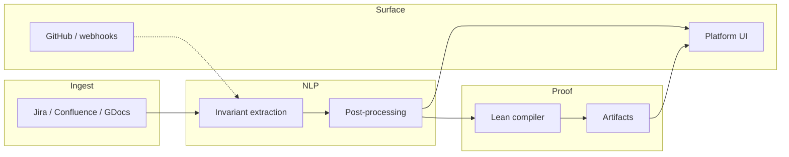

<div align="center">

# Spec-to-Proof

**From product specs to machine-checked Lean 4 guarantees**

[](https://github.com/fraware/spec-to-proof/actions)
[](https://opensource.org/licenses/MIT)
[](https://www.rust-lang.org/)
[](https://www.typescriptlang.org/)
[](https://leanprover.github.io/)

<br/>


<br/>

[Quick start](#quick-start) · [Architecture](#architecture) · [Stack](#technology-stack) · [Contributing](CONTRIBUTING.md) · [Security](SECURITY.md)

</div>

---

## Why this project

Product specs are written in natural language; formal guarantees live in mathematics. Spec-to-Proof bridges that gap: it **extracts invariants** from everyday documents, **reasons** about them with modern NLP, and **grounds** the result in **Lean 4** so “should” becomes something you can check, not just hope for.

The system is built as a **Rust workspace** for performance and safety, a **Next.js** surface for humans, and **Lake**-managed Lean for proof artifacts—wired together with **gRPC** and clear operational boundaries.

---

## What you get

| Capability | What it means |
| --- | --- |
| **Ingest** | Connectors and pipelines for sources such as Jira, Confluence, and Google Docs. |
| **Extraction** | LLM-assisted invariant discovery from plain English, with guardrails and post-processing. |
| **Proof engine** | Lean compiler service, artifact storage, and integration with the proof farm. |
| **Platform UI** | Next.js app (under `platform/ui`) for review, disambiguation, and workflow. |
| **Ops-ready** | Terraform, Helm, Docker Compose for local stacks; CI that mirrors what you run locally. |

---

## Architecture

High-level data flow: **documents → invariants → Lean artifacts → storage & UI**.



<details>
<summary>ASCII diagram (plain-text fallback)</summary>

```
┌─────────────────┐    ┌─────────────────┐    ┌─────────────────┐
│   Ingest        │    │   NLP           │    │   Proof         │
│                 │    │                 │    │                 │
│ • Connectors    │───▶│ • Extraction    │───▶│ • Lean compiler │
│ • Normalization │    │ • Disambiguation│    │ • Proof farm    │
└─────────────────┘    └─────────────────┘    └─────────────────┘
                                │
                                ▼
                       ┌─────────────────┐
                       │  Platform UI    │
                       └─────────────────┘
```

</details>

---

## Technology stack

| Layer | Choices |
| --- | --- |
| **Rust** | Root workspace: `proto`, `nlp`, `proof` (`Cargo.toml`). The `ingest/` crate ships alongside but is not a workspace member yet—build it from that directory if you work on connectors. |
| **Frontend** | TypeScript, Next.js 14, tRPC—invoked from repo root via `package.json` scripts. |
| **Formal methods** | Lean 4 + Lake under `proof/lean/`. |
| **Contracts** | Protocol Buffers and gRPC (`proto/`). |
| **Infra** | Terraform (`terraform/`), Helm (`charts/`), optional local stack with Docker Compose. |
| **Data plane** | AWS S3, DynamoDB, Redis; optional NATS JetStream via Compose for local dev. |

---

## Quick start

**Prerequisites:** [Rust / rustup](https://rustup.rs/) (see `rust-toolchain.toml`), [Node.js](https://nodejs.org/) 20+, and optionally [elan](https://github.com/leanprover/elan) for `proof/lean`.

| Step | Command |
| --- | --- |
| 1. Clone | `git clone https://github.com/fraware/spec-to-proof.git && cd spec-to-proof` |
| 2. Node deps | `npm ci` |
| 3. Rust build | `cargo build --workspace` |
| 4. Rust tests | `cargo test --workspace` |
| 5. UI (from root) | `npm run lint` → `npm run type-check` → `npm test` → `npm run dev` |
| 6. Lean (optional) | `cd proof/lean && lake build` |
| 7. Full lint like CI | `./scripts/ci-lint.sh` (POSIX) or `./scripts/ci-lint.ps1` (Windows PowerShell) |

For optional local dependencies: copy [.env.example](.env.example) to `.env`, then `docker compose up -d`. Example service runs:

```bash
cargo run -p nlp --bin invariant_extractor
cargo run -p proof --bin lean_compiler
```

More detail: [CONTRIBUTING.md](CONTRIBUTING.md).

---

## Repository layout

```
spec-to-proof/
├── proto/           # Protobuf + generated Rust bindings
├── nlp/             # NLP pipeline and prompts
├── proof/           # Proof service, Lean project under proof/lean/
├── platform/ui/     # Next.js frontend
├── ingest/          # Connectors (standalone crate; not in root workspace)
├── lean-farm/       # Lean job runner image and tooling
├── terraform/       # Infrastructure as code
├── charts/          # Helm charts
├── docs/adr/        # Architecture decision records
├── e2e/             # End-to-end fixtures and tests
└── scripts/         # CI-aligned lint scripts (sh + ps1)
```

---

## Quality and CI

Continuous integration runs **Rust** (fmt, clippy with warnings denied, tests, `cargo deny`, `cargo audit`), **Node** (lint, typecheck, Jest), **Lean** (`lake build`), **infra** (Terraform validate, Helm lint), and a **Docker** build for `lean-farm` with an informational container scan.

Run the same surface locally with `./scripts/ci-lint.sh` or `./scripts/ci-lint.ps1`.

---

## Contributing

We welcome contributions. Start with [CONTRIBUTING.md](CONTRIBUTING.md) for prerequisites, commands, and optional NLP integration tests. Architectural context lives in [docs/adr/](docs/adr/).

---

## Security

Report vulnerabilities privately: see [SECURITY.md](SECURITY.md).

---

## License

This project is licensed under the MIT License—see [LICENSE](LICENSE).
